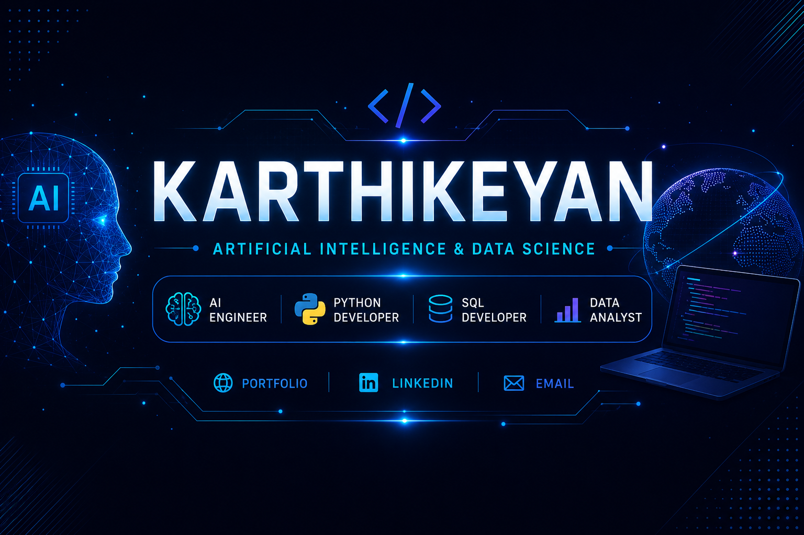

  

  

## 👨‍💻 About Me

- 🎓 B.Tech in Artificial Intelligence & Data Science
- 🤖 Passionate about Artificial Intelligence & Generative AI
- 🐍 Python & SQL Developer
- 📊 Data Analyst with Power BI
- 🌱 Currently building AI, Data Analytics and Full Stack projects
- 🚀 Portfolio: https://karthikeyan-portfolio-rust.vercel.app/

<h1 align="center">Hi 👋, I'm Karthikeyan</h1>
<h2 align="center">
  
   🎓Graduate in Artificial Intelligence &amp; Data Science
  
</h2>

  

  <a href="https://karthikeyan-portfolio-rust.vercel.app/">
    🌐 Portfolio
  </a>
  •
  <a href=www.linkedin.com/in/karthi-keyan-ai>
    LinkedIn
  </a>
  •
  <a href="mailto:karthisampath11@gmail.com">
    Email
  </a>

